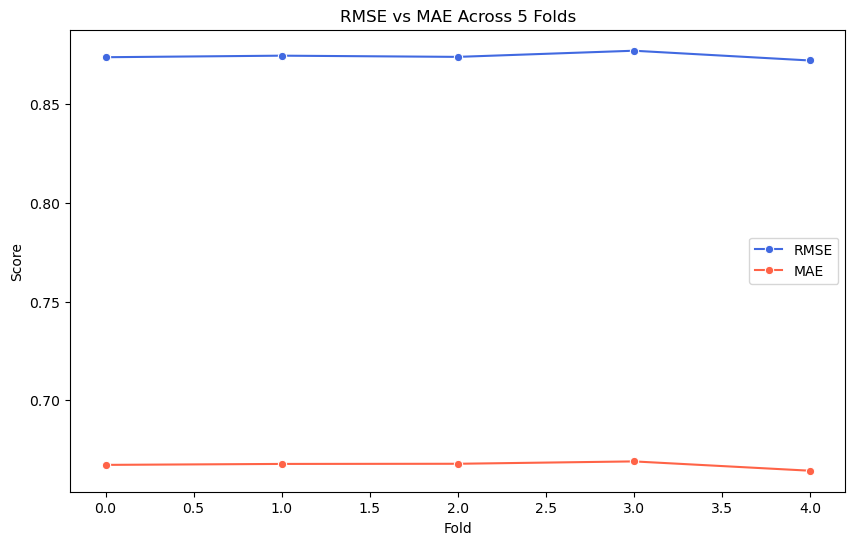
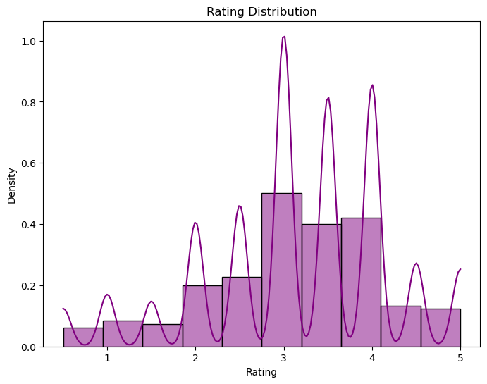

# Recommendation System

## Overview

The project combines two files to create a dataframe to provide recommendations to the user. A sample had to be created to create the evaluations below due to the large size of the data files.

## Business Problem

* Provide top 5 movie recommendations to a user based on their ratings of other movies

## Analysis

<u>Data</u>
* Ratings.csv: Contains the users with the ratingd they gave to each movie
* Movies.csv: Contains the names of the movies with their respective Id's as well as the genres

<u>Method</u>
* SVD (Singular Value Decomposition)

### Files

These are a representation of the files used to get movie recommendations. 

1. Ratings.csv

        userId	        movieId	        rating	        timestamp
        
        1	            1	            4.0	            1225734739
        1	            110	            4.0	            1225865086
        1	            158	            4.0	            1225733503
        1	            260	            4.5	            1225735204
        1	            356	            5.0	            1225735119

2. Movies.csv

        movieId      title	                                  genres

    	1	         Toy Story (1995)	                      Adventure|Animation|Children|Comedy|Fantasy
    	2	         Jumanji (1995)	                          Adventure|Children|Fantasy
    	3	         Grumpier Old Men (1995)	              Comedy|Romance
    	4	         Waiting to Exhale (1995)	              Comedy|Drama|Romance
    	5	         Father of the Bride Part II (1995)       Comedy

### Model

<b><u>SVD(Singular Value Decomposition)</u></b>

Ratings.csv file is a huge dataset and required a 
Focus on important factors, faster computation
Effective for large datasets
Uncovers hidden relationship between users and items

Below are the scores when evaluating the performance of the model on a rating scale of 0 - 5. RMSE of 0.8761 indicate relatively accurate predictions on the movie recommendation. MAE of 0.6677 indicates the system is off by 0.67 points which is relatively good accuracy. FCP of 0.6259 indicates 62.59% of movies recommended to the user are correct.

    RMSE: 0.8761
    MAE:  0.6677
    FCP:  0.6259

<b>Cross Validation</b>

Cross Validation was performed to find the performance of the model when it given unseen data and provide a reliable estimate of the models performance.

    Evaluating RMSE, MAE of algorithm SVD on 5 split(s).

                        Fold 1  Fold 2  Fold 3  Fold 4  Fold 5  Mean    Std     
    RMSE (testset)      0.8738  0.8746  0.8740  0.8771  0.8722  0.8743  0.0016  
    MAE (testset)       0.6673  0.6678  0.6679  0.6691  0.6643  0.6673  0.0016  
    Fit time            6.02    6.19    5.53    5.30    5.36    5.68    0.36    
    Test time           0.24    0.23    0.14    0.14    0.14    0.18    0.05    

Results on Cross Validation

    Average RMSE with default parameters:  0.8743437780848374
    Average MAE with default parameters:  0.6672746584172468

This shows on average the model is performing relatively well on the RMSE and MEA scores over multiple iterations in the trainingset.

## Conclusion

The image below shows the count on the ratings and what the model is predicting on. There is a high number of movies rated between 3 and 4 and also a large number of movies been predicted on them. This would indicate that the model will need to be adjusted to ensure there isn't a bias to a particular rating.

* Introduce more features to provide a better recommendation like user interaction
* Introduce bias terms for users and items can help model preferences more effectively
